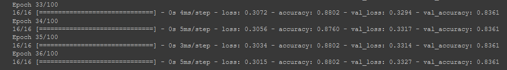

# Heart-attack-Analysis

## Data 

## Data visualisation

## Heart attack by resting blood pressure (in mm Hg)

.PNG)

## Heart attack by age

## Heart attack by chest pain type 

## Training the model

## Evaluation

